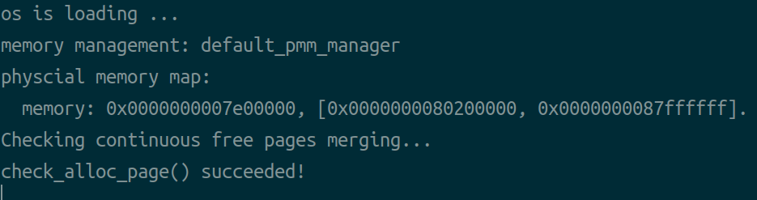
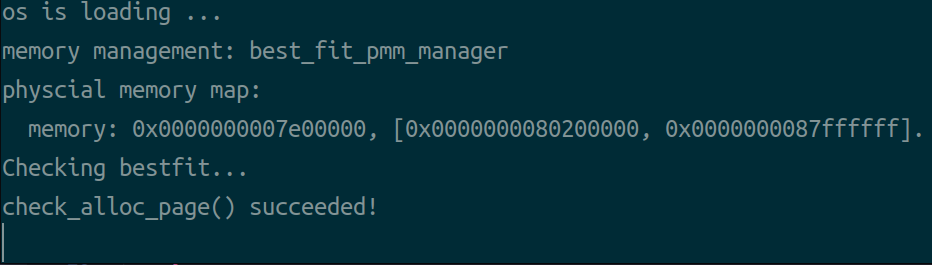

## Assignment 4

Please complete a report in English **in English in English in English** and upload the corresponding codes.

The files should be uploaded to **blackboard** directly without compression **without compression without compression without compression**

The files to be submitted for this assignment are: 

1. report.pdf 
2. default_pmm.c 
3. best_fit_pmm.c

------

**Q1. [15 pts]** Read Chapter 15 of “Three Easy Pieces” (https://pages.cs.wisc.edu/~remzi/OSTEP/vm-mechanism.pdf ) and explain how do the CPU hardware and the operating system cooperate in the procedure of address translation.


**Answer:**

CPU:  

- We require two different CPU modes, let CPU switches modes in some particular options.
- The hardware provides base and bound register, they are part of the memory management unit (MMU) of the CPU. When a user program is running, the hardware will translate each address, by adding the base value to the virtual address generated by the user program.
- The hardware must also be able to check whether the address is valid, which is accomplished by using the bounds register and some circuitry within the CPU.
- The hardware should provide special instructions to modify the base and bounds registers, allowing the OS to change them when different processes run
- The CPU must be able to generate exceptions in situations where a user program tries to access memory illegally.

OS:

- The OS must take action when a process is created, finding space for its address space in memory. When a new process is created, the OS will have to search a data structure (often called a free list) to find room for the new address space and then mark it used. 

- The OS must do some work when a process is terminated (i.e., when it exits gracefully, or is forcefully killed because it misbehaved), reclaiming all of its memory for use in other processes or the OS.
- The OS must also perform a few additional steps when a context switch occurs. The OS must save and restore the base-and-bounds pair when it switches between processes.
- The OS must provide exception handlers, or functions to be called, as discussed above; the OS installs these handlers at boot time (via privileged instructions). 

Cooperation:

With address translation, the OS can control each and every memory access from a process, ensuring the accesses stay within the bounds of the address space. Key to the efficiency of this technique is hardware support, which performs the translation quickly for each access, turning virtual addresses (the process’s view of memory) into physical ones (the actual view).

- Mode: The CPU has different mode bit, and OS runs in different mode. And OS and CPU can switch the mode in certain special occasions, to do instruction in proper mode.
- Manage space for process: OS maintain some data structures: free list, page table... The OS manage the informations about map from virtual memory to physical, and CPU can translate virtual addresses and check if within bounds.
- Update Registers: The OS should save and restore the base/bounds registers when context switch occurs, and CPU does the update options, using these registers to support address translation and bounds checks.
- Exception: When processes try to access privileged instructions or out-of-bounds memory, the CPU should raise exceptions, and OS provides the exception handlers codes to deal with the situations in detail.

Summary:

Besides, from the section 15.4 & 15.5, there are two tables summarize the requirements for dynamic relocation:

| Hardware Requirements                                        | Notes                                                        |
| ------------------------------------------------------------ | ------------------------------------------------------------ |
| Privileged mode                                              | Needed to prevent user-mode processes from executing privileged operations |
| Base/bounds registers                                        | Need pair of registers per CPU to support address translation and bounds checks |
| Ability to translate virtual addresses and check if within bounds | Circuitry to do translations and check limits; in this case, quite simple |
| Privileged instruction(s) to update base/bounds              | OS must be able to set these values before letting a user program run |
| Privileged instruction(s) to register exception handlers     | OS must be able to tell hardware what code to run if exception occurs |
| Ability to raise exceptions                                  | When processes try to access privileged instructions or out-of-bounds memory |

| OS Requirements        | Notes                                                        |
| ---------------------- | ------------------------------------------------------------ |
| Memory management      | Need to allocate memory for new processes; Reclaim memory from terminated processes; Generally manage memory via **free list** |
| Base/bounds management | Must set base/bounds properly upon context switch            |
| Exception handling     | Code to run when exceptions arise; likely action is to terminate offending process |


**Q2. [15 pts]** Read Chapter 16 ”( https://pages.cs.wisc.edu/~remzi/OSTEP/vm-segmentation.pdf) and chapter 18 (https://pages.cs.wisc.edu/~remzi/OSTEP/vm-paging.pdf ) of “Three Easy Pieces” and compare segmentation and paging. Your answer should cover all aspects (e.g., size of chunks, management of free space, context switch overhead, fragmentation, status bits and protection bits, etc.) and compare them side-by-side.


**Answer:**

| Aspect                   | Segmentation                                                 | Paging                                                       | Comparison                                             |
| ------------------------ | ------------------------------------------------------------ | ------------------------------------------------------------ | ------------------------------------------------------ |
| Size of chunks           | Variable-sized                                               | Fixed-sized                                                  | Different strucure                                     |
| Management of free space | Use a free-list management algorithm that tries to keep large extents of memory available for allocation, such as best-fit, worst-fit and first-fit. | OS keeps a free list of all free pages for this, and just grabs the first several pages that satisfy the demanded size off of this list. | Paging is more direct and simple                       |
| Context switch overhead  | The segment registers need to be saved and restored.         | Use more cache such as TLB to accelerate lookup and reduce the register update. | Overhead of segmentation is higher and paging is lower |
| Fragmentation            | Suffers from external fragmentation problems.                | Suffers from internal fragmentation problems.                | Deal with different fragmentation problems             |
| Status bits              | It may has its own information bits (such as 'Grows Positive' bit). but this book seems doesn't give the definition of  'Status bits' directly. | a present bit (P); a read/write bit (R/W); a user/supervisor bit (U/S); a few bits (PWT, PCD, PAT, and G) that determine how hardware caching works for these pages; an accessed bit (A) and a dirty bit (D); | Paging has more bits to represent its status           |
| Protection bits          | Basic support adds a few bits per segment, indicating whether or not a program can read or write a segment, or perhaps execute code that lies within the segment. | Has bits indicating whether the page could be read from, written to, or executed from. | Have similar function.                                 |


**Q3. [15 pts]** Consider a system with the following specifications:

- 46-bit virtual address space
- Page size of 8 KBytes
- Page table entry size of 4 Bytes
- Every page table is required to fit into a single page

How many levels of page tables would be required to map the entire virtual address space? Please document the format of a virtual address under this translation scheme. Briefly explain your rationale.

> hint: There is the example of the format of a 32-bit virtual address in lecture.


**Answer:**

For page size bit, 8KB = $2^3 * 2^{10}$ B. 13 bits offset is required.

For PTE number, the 8KB page size need $2^{13-2}=2^{11}$ PTEs. 11 bits is required.

For page number, $46-13=33$, 33 bits is required.

$33/11=3.0$, need 3-level mapping.

Translation scheme:

| L1 index | L2 index | L3 index | Offset |
| -------- | -------- | -------- | ------ |
| 45-35    | 34-24    | 23-13    | 12-0   |


**Q4. [15 pts]** Consider a system with following specifications: Both virtual address space and physical address are 32bits. Page table entry size of 4Bytes

**(a)** Suppose it uses 1-level page table, the format of the translation scheme is

> | 20 bit page | 12 bit offset |

What is the page size? What is the maximum page table size?


**Answer:**

For PTE number: $2^{20}$ , for page size: $2^{12}$ Byte 4KB

Page table size: $2^{20+2}$ Byte, 4 MB.

Page size: 4 KB; maximum page table size: 4 MB.


**(b)** Suppose it uses 2-level page table, the format of the translation scheme is

> | 10 bit page | 10 bit page | 12 bit offset |

- Please write down the 1-st level page number and its offset in decimal(base 10) of virtual address **0xC302C302** (base 16).
- Please write down the 2-nd level page number and its offset in decimal(base 10) of virtual address **0xEC6666AB** (base16).


**Answer:**

0xC302C302: `0b 1100001100, 0000101100, 001100000010`

- Level 1: 0b1100001100 = 780
- offset: 0b001100000010 = 770

0xEC6666AB: `0b 1110110001, 1001100110, 011010101011`

- Level 2: 0b1001100110 = 614
- offset: 0b 011010101011 = 1707


**Q5. [20 pts]** Please realize merging free blocks in `default_free_pages()`


```c
// kern/mm/defalut_pmm.c: default_free_pages()

//--------------------Merge Free Block-----------------
// Get base Page list_entry `le`, with its prev and next list_entry
list_entry_t *le = &base->page_link;
list_entry_t *prev_le = list_prev(le);
list_entry_t *next_le = list_next(le);

// Set current Page to `base`
p = base;

if (prev_le != &free_list) {
    // If true: the prev list_entry is not the fake head (it exits)
    // Get the Page pointer by the list_entry
    struct Page *prev_page = le2page(prev_le, page_link);

    // If the perv page's addr + its property = current page's addr
    if (prev_page + prev_page->property == p) {
        // If true: the two pages are consecutive, start to merge
        prev_page->property += p->property; // Update prev page's `property`
        p = prev_page; // Update current Page pointer to prev Page (for next merge)
        SetPageProperty(p); // Set its property bits
        ClearPageProperty(base); // Clear the base page property
        list_del(le); // Delete the base Page's list_entry from the free list
    }
}


if (next_le != &free_list) {
    // If true: the next list_entry is not the fake head (it exits)
    // Get the Page pointer by the list_entry
    struct Page *next_page = le2page(next_le, page_link);

    // If the current page's addr + its property = next page's addr
    if (p + p->property == next_page) {
        // If true: the two pages are consecutive, start to merge
        p->property += next_page->property; // Update prev page's `property`
        SetPageProperty(p); // Set its property bits
        ClearPageProperty(next_page); // Clear the base page property
        list_del(next_le); // Delete the base Page's list_entry from the free list
    }
}

//---------------------------------------------------
```

Output Screen Shot:




**Q6. [20 pts]** Realize bestfit in `best_fit_pmm.c` 


I only show `best_fit_alloc_pages()`. Other function definitions are just same as which in `defalut_pmm.c`

```c
// kern/mm/best_fit_pmm.c

static void
best_fit_init_memmap(struct Page *base, size_t n)
{
    assert(n > 0);
    struct Page *p = base;
    for (; p != base + n; p ++) {
        assert(PageReserved(p));
        p->flags = p->property = 0;
        set_page_ref(p, 0);
    }
    base->property = n;
    SetPageProperty(base);
    nr_free += n;
    if (list_empty(&free_list)) {
        list_add(&free_list, &(base->page_link));
    } else {
        list_entry_t* le = &free_list;
        while ((le = list_next(le)) != &free_list) {
            struct Page* page = le2page(le, page_link);
            if (base->property < page->property) {
                list_add_before(le, &(base->page_link));
                break;
            } else if (list_next(le) == &free_list) {
                list_add(le, &(base->page_link));
            }
        }
    }
}

static struct Page * 
best_fit_alloc_pages(size_t n)
{
    // Same as default
    assert(n > 0);
    if (n > nr_free) {
        return NULL;
    }
    struct Page *page = NULL;
    list_entry_t *le = &free_list;

    // Set the largest best property value as `nr_free` +1
    size_t best_property = nr_free + 1;

    // Traverse all pages
    while ((le = list_next(le)) != &free_list) {
        // Get the current Page
        struct Page *p = le2page(le, page_link);
        // Get the page's `property`
        unsigned int cur_property = p->property;
        // If the Page can be allocated, and it's best than previous
        if (cur_property >= n && cur_property < best_property) {
            page = p; // Record current Page as target
            best_property = cur_property; // Update best property
        }
    }

    // Same as default
    if (page != NULL) {
        list_entry_t *prev = list_prev(&(page->page_link));
        list_del(&(page->page_link));
        if (page->property > n) {
            struct Page *p = page + n;
            p->property = page->property - n;
            SetPageProperty(p);
            list_add(prev, &(p->page_link));
        }
        nr_free -= n;
        ClearPageProperty(page);
    }

    return page;
}
```

Output Screen Shot:

