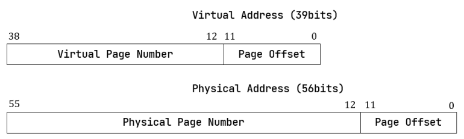

## Assignment 5

The files should be uploaded directly without compression without compression without compression without compression

The files to be submitted for this assignment are: 

1. report.pdf

------

**Q1. [50pts]** In a demand-paging memory management system, suppose the page table contents for a certain process are as follows (for a single-level page table, with H denoting hexadecimal values):

| Virtual Page No. | Page Frame No. | Valid Bit |
| ---------------- | -------------- | --------- |
| 0                |                | 0         |
| 1                | 122H           | 1         |
| 2                | 233H           | 1         |

The page size is $4$ KB, the access time for main memory is $100$ ns, the access time for the TLB is $10$ ns, and the average time to handle a page fault, including the time to update the TLB and page table, is $10^8$ ns. Assuming:

① The TLB is initially empty;

② During address translation, the TLB is accessed first. If there is a miss in the TLB, the page table is accessed subsequently (ignoring the time taken to update the TLB after accessing the page table);

③ A valid bit set to 0 indicates that the page is not present in memory, causing a page fault interrupt. After the page fault interrupt handling is completed, the execution returns to the instruction that triggered the page fault to execute.

Given a virtual address access sequence of 1333H, 0555H, 2555H：

(1）What is the time required to sequentially access each of the three virtual addresses mentioned above? Give the calculation process. The answer should include the time cost of the final access to the physical address?

(2）Suppose the operating system permits processes to use only two physical pages with frame numbers 122H and 233H, employing the Least Recently Used (LRU) replacement algorithm. Given the certain access sequence above, what is the physical address for the virtual address 0555H? Please explain the reasoning behind your answer.

(1) 

- 1333H: page no.1, offset 333H
    - TLB: 10 ns;
    - TLB miss, main memory for virtual address: 100 ns;
    - after update page frame, main memory to get  content: 100 ns;
    - Total: 210 ns
- 0555H: page no.0, offset 555H
    - TLB: 10 ns;
    - TLB miss, main memory for virtual address: 100 ns;
    - page no.0 valid 0, page fault occurs, handle: 10^8 ns;
    - access TLB: 10 ns;
    - main memory: 100 ns
    - Total: 100000220 ns
- 255H: page no.2, offset 555H
    - TLB: 10 ns
    - TLB miss, main memory for virtual address: 100 ns;
    - after update page frame, main memory to get  content: 100 ns;
    - Total: 210 ns

(2)

access 1333H: pass

access 0555H: page fault, replace page no.2 with page no.0

page no.0: page frame: 233H (same as page no.2 previous)

final address: 233555H

**Q2. [50pts]** Here is a computer with a riscv64 architecture, employing the sv39 multi-level paging mechanism. The formats for physical and virtual addresses are as follows:

Assuming there are only three free physical pages in memory, with physical page numbers being 0x00000086000, 0x00000086001, and 0x00000086002. When a process requests a physical page, the operating system adopts an allocation strategy of assigning physical page numbers **from largest to smallest**. At a certain point, the value in the Satp register is 0x8000000000084000, with all PTEs in the root page table being zero. The current process attempts to access the valid virtual address 0x0000002123456789. Please simulate the computer's handling of the page fault interrupt, allocate the corresponding physical page, correctly fill in the corresponding page table entry, and find the corresponding physical address.

Complete the following blanks (in hexadecimal, ignoring the actual setting of flag bits in each level of page table entries, all flags set to 0 is OK).

1. The physical address of the root page table is (     ?     ), and the value of the (     ?     ) th page table entry is (     ?     ). 
2. The physical address of second-level page table is (     ?     ), and the value of the (     ?     ) th page table entry is (     ?     ). 
3. The physical address of third-level page table is (     ?     ), and the value of the (     ?     ) th page table entry is (     ?     ). 
4. The physical address corresponding to the virtual address 0x0000 0021 2345 6789 is (     ?     ).

`0x0000 0021 2345 6789` = `0|010 0001 00|10 0011 010|0 0101 0110|0111 1000 1001`

VPN:  0x84, 0x11A,  0x56

(1) 0x00 0000 8400 0000; 0x84; 0x0000 0000 2180 0800

(2) 0x00 0000 8600 2000; 0x11A; 0x0000 0000 2180 0400

(3) 0x00 0000 8600 1000; 0x56; 0x0000 0000 2180 0000

(4) 0x8600 0789

