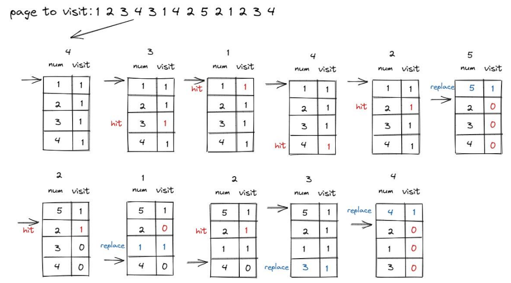

## Assignment 6

Please complete a report and upload the corresponding codes.

The files should be uploaded directly without compression without compression without compression without compression

The files to be submitted for this assignment are: 

1. report.pdf
2. swap_clock.c

------

**Q1. [50pts]** Read Chapter 21 of “Three Easy Pieces” (https://pages.cs.wisc.edu/~remzi/OSTEP/vm-beyondphys.pdf ) and explain what happens when the process accesses a memory page not present in the physical memory.


**Answer:**

1. If a page is not present, the OS is put in charge to handle the page fault. The OS page-fault handler runs to determine what to do. Virtually all systems handle page faults in software; even with a hardware-managed TLB.

2. If a page is not present and has been swapped to disk, the OS will need to swap the page into memory in order to service the page fault. The OS could use the bits in the PTE normally used for data such as the PFN of the page for a disk address. It looks in the PTE to find the address, and issues the request to disk to fetch the page into memory.
3. When the disk I/O completes, the OS will then update the page table to mark the page as present, update the PFN field of the page-table entry (PTE) to record the in-memory location of the newly-fetched page, and
    retry the instruction. This next attempt may generate a TLB miss, which would then be serviced and update the TLB with the translation (one could alternately update the TLB when servicing the page fault to avoid this step).
4. Finally, a last restart would find the translation in the TLB and thus proceed to fetch the desired data or instruction from memory at the translated physical address.
5. Note that while the I/O is in flight, the process will be in the blocked state. Thus, the OS will be free to run other ready processes while the page fault is being serviced, Because I/O is expensive, this overlap of the I/O (page fault) of one process and the execution of another is yet another way a multiprogrammed system can make the most effective use of its hardware.
6. Memory may be full (or close to it). Thus, the OS might like to first page out one or more pages to make room for the new page(s) the OS is about to bring in. The process of picking a page to kick out, or replace is known as the page-replacement policy.

We can see what the OS roughly must do in order to service the page fault. First, the OS must find a physical frame for the soon-to-be-faulted-in page to reside within; if there is no such page, we’ll have to wait for the replacement algorithm to run and kick some pages out of memory, thus freeing them for use here. With a physical frame in hand, the handler then issues the I/O request to read in the page from swap space. Finally, when that slow operation completes, the OS updates the page table and retries the instruction. The retry will result in a TLB miss, and then, upon another retry, a TLB hit, at which point the hardware will be able to access the desired item.


**Q2. [50pts]** Realize Clock algorithm in `swap_clock.c` 

Clock：Clock algorithm organizes pages into a circular linked list, just like a clock. The pointer points to the pages loaded the earliest. Besides, Clock algorithm requires a flag bit in PTE to indicate if the corresponding page is used. When the page is used, MMU in CPU will set the flag to 1. When system needs to replace a page, system read the PTE pointer points to, and replace it if the flag is 0, otherwise read the next PTE. The algorithm demonstrates the idea of LRU, and is easy to implement and costs less, but require hardware support to set an reference bit. Clock algorithm is the same as LRU essentially, but it skips pages with reference bit of 1



Code you may need:

```c
list_entry_t *curr_ptr;

*ptr_page = le2page(le, pra_page_link);

pte_t* ptep = get_pte(mm->pgdir, ptr_page->pra_vaddr, 0);

bool accessed = *pte & PTE_A;
```

Please realize algorithm in `swap_clock.c` . Change `sm` in `swap.c` to clock to test your code.

Please take screen-shot of your code(with annotations) and the running result.


**Answer:**

```c
static int
_clock_init_mm(struct mm_struct *mm)
{   
    // init the list like lab 13 slide
    list_init(&pra_list_head);

    // swap manager's private data
    mm->sm_priv = &pra_list_head;

    // set ptr to head
    curr_ptr = (list_entry_t*) mm->sm_priv;

    return 0;
}

static int
_clock_map_swappable(struct mm_struct *mm, uintptr_t addr, struct Page *page, int swap_in)
{   
    // find the head list and target list entry
    list_entry_t *head = curr_ptr;
    list_entry_t *entry =& (page->pra_page_link);
    assert(head != NULL);
    assert(entry != NULL && head != NULL);
    assert(curr_ptr != NULL);

    // record the page access situlation
    // link the new page to previous page of current pointer of the pra_list_head qeueue.
    list_add_before(curr_ptr, entry);

    return 0;
}


static int
_clock_swap_out_victim(struct mm_struct *mm, struct Page ** ptr_page, int in_tick)
{   
    // by lab 13 slide, check the head is leagal
    list_entry_t *head = (list_entry_t*) mm->sm_priv;
    assert(head != NULL);
    assert(curr_ptr != NULL);
    assert(in_tick == 0);

    // forever find list entry
    while(1) {
        // if head, to next
        if(curr_ptr == head) {
            curr_ptr = list_next(curr_ptr);
        }
        // get ptr_page
        *ptr_page = le2page(curr_ptr, pra_page_link);
        // get pte
        pte_t* ptep = get_pte(mm->pgdir, (*ptr_page)->pra_vaddr, 0);
        
        // get access state
        int accessed = *ptep & PTE_A;
        if (accessed) {
            // set accessd to 0
            *ptep &= ~PTE_A;
        } else {
            // delete the entry
            curr_ptr = list_next(curr_ptr);
            list_del(list_prev(curr_ptr));
            break;
        }
        // search to next
        curr_ptr = list_next(curr_ptr);
    }

    return 0;
}
```


Screen shot:


