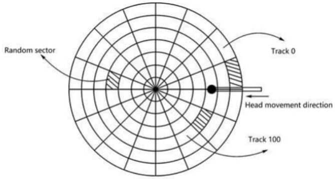

## Assignment 7

Please complete a report and upload the corresponding codes.

The files should be uploaded directly without compression without compression without compression without compression

The files to be submitted for this assignment are:

1. report.pdf

------

**Q1 [50pts]** Please read "Three Easy Pieces" Ch36 https://pages.cs.wisc.edu/~remzi/OSTEP/file-devices.pdf, and answer the following questions:

(1) What are the pros and cons of polling and interrupt-based I/O?

(2) What are the differences between PIO and DMA?

(3) How to protect memory-mapped I/O and explicit I/O instructions from being abused by malicious user process?

**Answer:**

(1)

Polling:

- Pros: It's simple and working. If a device is fast, it may be best to poll.
- Cons: Polling seems inefficient; specifically, it wastes a great deal of CPU time just waiting for the (potentially slow) device to complete its activity, instead of switching to another ready process and thus better utilizing the CPU.

Interrupt-based I/O

- Pros: Interrupts thus allow for overlap of computation and I/O, which is key for improved utilization. If a device is slow, interrupts are best.
- Cons: Using an interrupt for faster device will actually slow down the system: switching to another process, handling the interrupt, and switching back to the issuing process is expensive.

(2)

PIO:

With PIO, the CPU spends too much time moving data to and from devices by hand. 

When using PIO to transfer a large chunk of data to a device, the CPU is once again overburdened with a rather trivial task, and thus wastes a lot of time and effort that could better be spent running other processes. 

DMA:

A DMA engine is essentially a very specific device within a system that can orchestrate transfers between devices and main memory without much CPU intervention.

To transfer data to the device, for example, the OS would program the DMA engine by telling it where the data lives in memory, how much data to copy, and which device to send it to. At that point, the OS is done with the transfer and can proceed with other work. When the DMA is complete, the DMA controller raises an interrupt, and the OS thus knows the transfer is complete.

Differences Summary:
Unlike PIO, DMA can transfer a bigger part of data without using CPU. Thus, CPU has more time to deal with other main tasks instead of transfer each chunk of data by hand. DMA is much more efficient.

(3)

In explicit I/O instructions part, the book mentioned privileged instructions: The OS controls devices, and the OS thus is the only entity allowed to directly communicate with them. 

In memory mapped I/O part, to access a particular register, the OS issues a load (to read) or store (to write) the address; the hardware then routes the load/store to the device instead of main memory. The protection was not directly mentioned, but it should be similar to I/O instructions'  strategy: OS control the access.

**Q2. [50pts]** Disk scheduling Suppose the computer system uses the disk as the following:

The disk has 200 tracks in total. Let a single-sided disk rotation speed be 12000r/min, each track has 100 sectors, and the average movement time between adjacent tracks is 1 ms. If at some point, the head is located at track 100 and moves in the direction in which the track number increases, the track number request queue is 70, 20, 90, 110, 60, 20. A randomly  distributed sector is read for each track in the request queue.

(1) READ/WRITE data time = (1)____+ (2)____+ (3)____. 

(2) Use FIFO\SSTF\SCAN\CSCAN algorithm to read the six sectors:

​	a) write the track access sequence

​	b) how much time is required in total? The calculation process is required.

**Answer:**

(1) Seek time; Rotational latency; Transfer time;

(2)

Assume each time rotate half a circle for random access:

Rotation Delay: $0.5/(12000/60)=2.5 \times 10^{-3}$ sec = 2.5 ms

Ignore the transfer time:

FIFO

- 70, 20, 90, 110, 60, 20
- $(30+50+70+20+50+40)+2.5 \times 6 = 260+15 = 275$ ms

SSTF

- 110, 90, 70, 60, 20, 20
- $(10+20+20+10+40+0)+2.5 \times 6 = 100+15 = 115$ ms

SCAN

- 110, 90, 70, 60, 20, 20
- $(10+89+109+20+10+40+0)+2.5 \times 6 = 278+15=293$ ms

CSCAN

- 110, 20, 20, 60, 70, 90
- $(10+89+199+20+0+40+10+20)+2.5 \times 6 = 388+15 = 403$ ms

